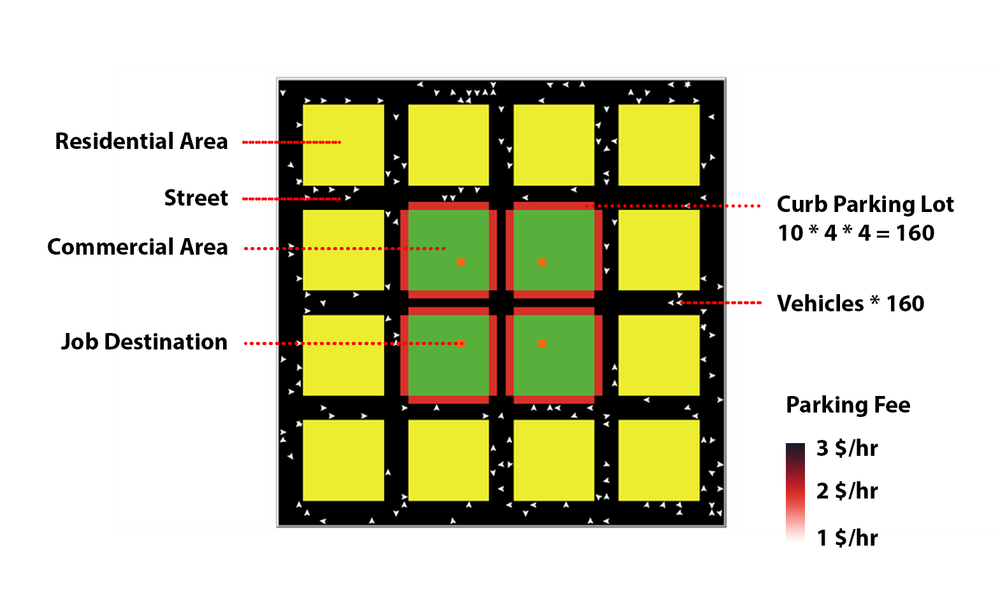
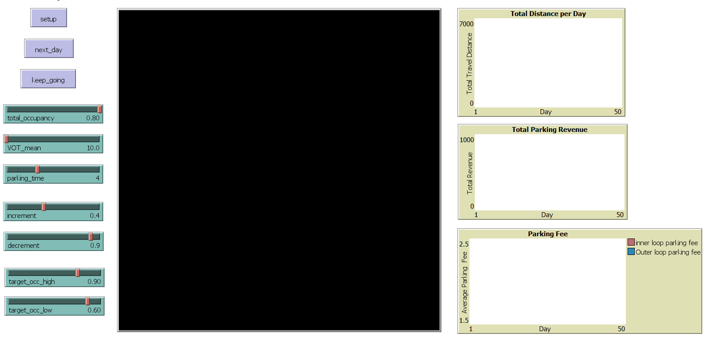
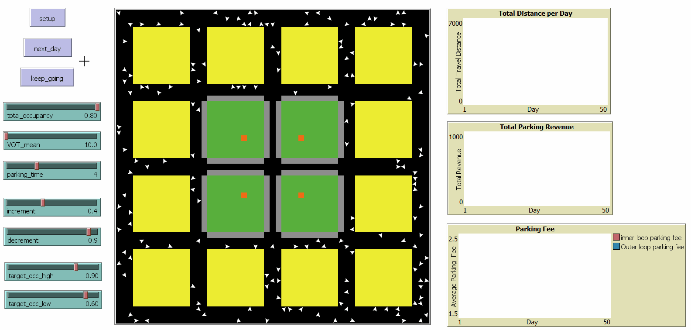
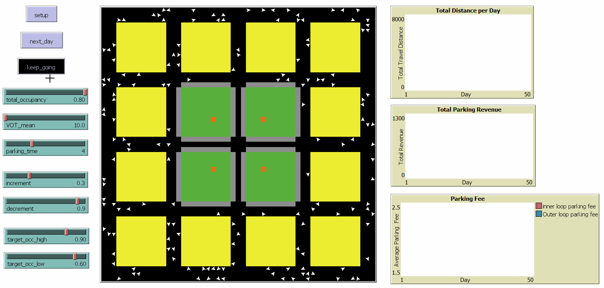

# Dynamically-priced Curb Parking Simulation

 *Jingzong Wang, Jiazheng Zhu*

04/2020

## Introduction

"Vehicles in search of on-street parking create an environmental and economic impact: they increase network traffic flow and congestion, heighten pollutant emissions levels, create additional noise, give rise to time delays for through vehicles, and lead to potential safety hazards when vehicles maneuver into or out of on-street spaces." (Ghent, Peer. 2015) Dynamic pricing of curb parking is one of strategies designed to manage parking congestion(Fichman 2016). In theroy, the dynamic pricing strategy works as follows: parking demand and supply will equilibrate so that there are always at least a few spaces available on each
block, minimizing the time it takes to find parking and minimizing congestion and pollution (Shoup 2014). This model is a simplified simulation of dynamically-priced curd parking designed to examine the robustness of this theory.

## How it works

#### About the world

The center of this world is the commercial area (green patches) consisting of four blocks, each of which has a job destination and surrounded by 10 curb parking spaces on each side. There are also 160 commuters who are randomly distributed in residential area (yellow patches).  

We can click setup button to setup the world.

#### Dynamic Process  

Each day, commuters will try to drive from their own start points at same time to available parking lot with minimal cost to them. The total cost is consist of total parking fee and time of walking from parking lot to job destination. Total parking fee is cauculated by multipling parking fee and `parking time`, which can be adjusted by user. Walking time is monetized by multipling drivers' value of time (VOT). (The overall VOT obeys a normal distribution with a given mean, `VOT mean`, and standard deviation of 8)  The simulation of this day stops when the total occupancy rate reach the given `total occupancy rate`.    

We can click next_day to run the simulation.

 

At the end of the simulation for each day, occupancy rates for each side of commerical blocks will be calcualted. If the occupancy rate is higher or lower than target occupancy rate (`target_occ_high` and `target_occ_low` ), then the parking fee of this side will increase or decrease accordingly when the next day comes. The more it varies from target range, the more increment or decrement will be, and the ratio can be adjusted by changing `increment` and `decrement`. The original parking fee is 2$/hr.  Then, the average inner loop and outter loop parking fee will be recorded, as well as total travel distance and  total parking revenue. 

By clicking keep_going button, we can see the long-term simulation. 

The chart on the right-top shows that the total travel distance dramatically dropped during the first several days and then almostly maintained the same. At the same time, the outer loop parking fee was keeping decreasing while the inner loop parking fee was increasing consistantly. During the whole process, total parking revenue didn't change much. This result indicates that under certain conditions, the dynamic pricing strategy can significantly minimize parking congestion and maintain current parking revenue at the same time. 

## Limitations

1. This model doesn't take driving time into consideration.
2. There is no competitive travel modes.
3. The path-finding algorithm is not perfect so that sometimes the model can get stuck, which rarely happens though.

## Download 

NetLogo Model: <a href="https://github.com/JingzongWang/JingzongWang.github.io/blob/master/assets/dynamically-priced-curb-parking-simulation.nlogo">dynamically-priced-curb-parking-simulation.nlogo</a>

To run this model, you have to install <a href="https://ccl.northwestern.edu/netlogo/">NetLogo</a>

## References

Ghent, Peer. 2015. "Optimizing Performance Objectives for Projects of Congestion Pricing for Parking." *Transportation Research Record: Journal of the Transportation Research Board* 2530: 101‐105.

Fichman, Michael. (2016). *An Evaluation of Pittsburgh's Dynamically‐Priced Curb Parking Pilot*. 10.13140/RG.2.2.16274.25289. 

Shoup, Donald. 2004. *The High Cost of Free Parking*. Chicago, IL: Planners Press, American Planning
Association.