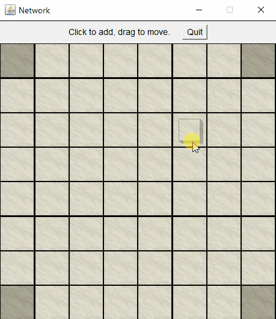
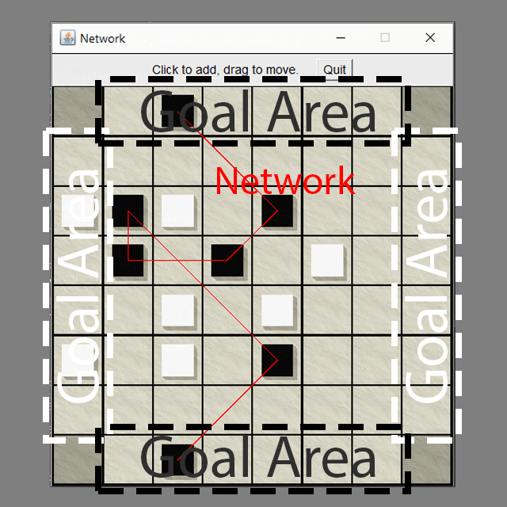
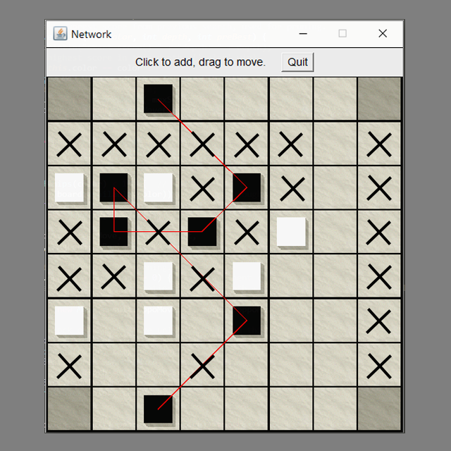

# Network (The Game)

*Jingzong Wang*

10/2020

<a href="https://people.eecs.berkeley.edu/~jrs/61b/hw/pj2/">CS 61B Project 2</a>

White: Human, Black: Machine

### Object of Play

Each player tries to complete a "network" joining its two goal areas. A network is a sequence of six or more chips that starts in one of the player’s goal areas and terminates in the other. Each consecutive pair of chips in the sequence are connected to each other along straight lines, either orthogonally
(left, right, up, down) or diagonally.

An enemy chip placed in the straight line between two chips breaks the connection.

Although more than one chip may be placed in a goal area, a network can have only two chips in the goal areas: the first and last chips in the network.

A network cannot pass through the same chip twice, even if it is only counted once.

A network cannot pass through a chip without turning a corner (i.e. changing direction).

### Legal Moves

Fout rules of legal play:

1. No chip may be placed in any of the four corners.
2. No chip may be placed in a goal of the opposite color.
3. No chip may be placed in a square that is already occupied.
4. A player may not have more than two chips in a connected group, whether
   connected orthogonally or diagonally.

eg. In the following diagram, Black is not permitted to place a chip in any of the squares marked with an X.

#### Add moves & Step moves

There are two kinds of moves: add moves and step moves. In an add move, a player places a chip on the board (following the rules above). Each player has ten chips, and only add moves are permitted until those chips are exhausted. If neither player has won when all twenty chips are on the board, the rest of the game comprises step moves. In a step move, a player moves a chip to a different square, subject to the same restrictions. A player is not permitted to decline to move a piece (nor to "move from square ij to square ij"). 

A step move may create a network for the opponent by unblocking a connection between two enemy chips. If the step move breaks the network at some other point, the enemy does not win, but if the network is still intact when the chip has been placed back on the board, the player taking the step move loses. If a player makes a move that causes both players to complete a network, the other player wins.

Bibliographic note: Network is taken from Sid Sackson, "A Gamut of Games," Dover Publications (New York), 1992.

### Have Fun! (Please let me know if you can win)

Please make sure you have java jre installed: <a href="https://www.java.com/en/download/">Java</a>

Runnable Jar:  <a href="https://github.com/JingzongWang/JingzongWang.github.io/blob/master/assets/network-game/network.jar">network.jar</a>

